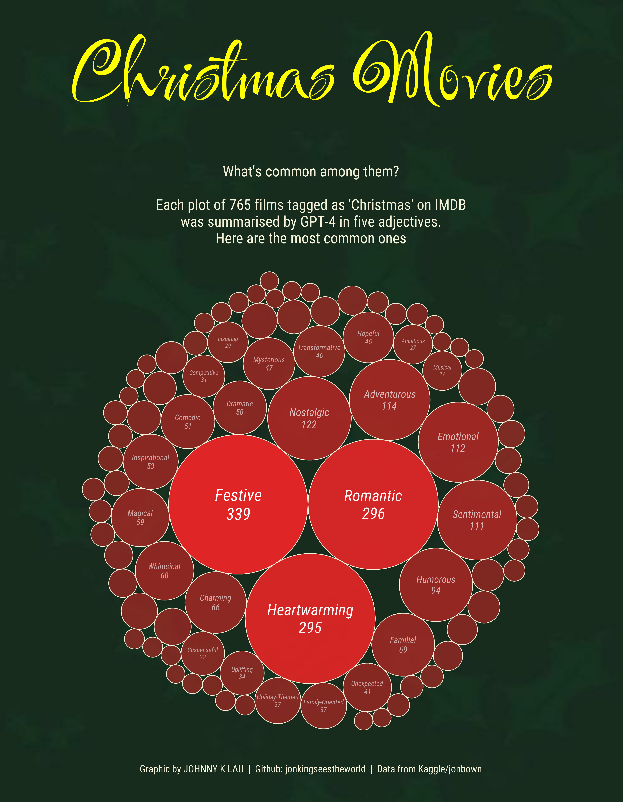
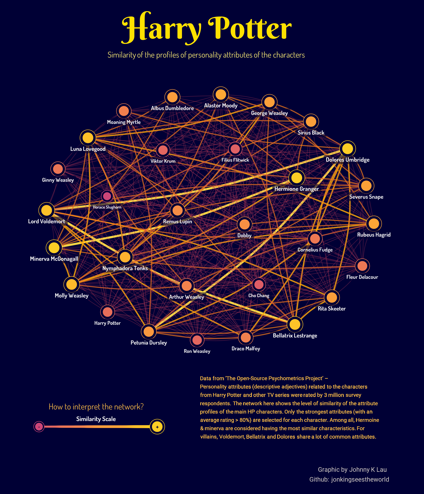
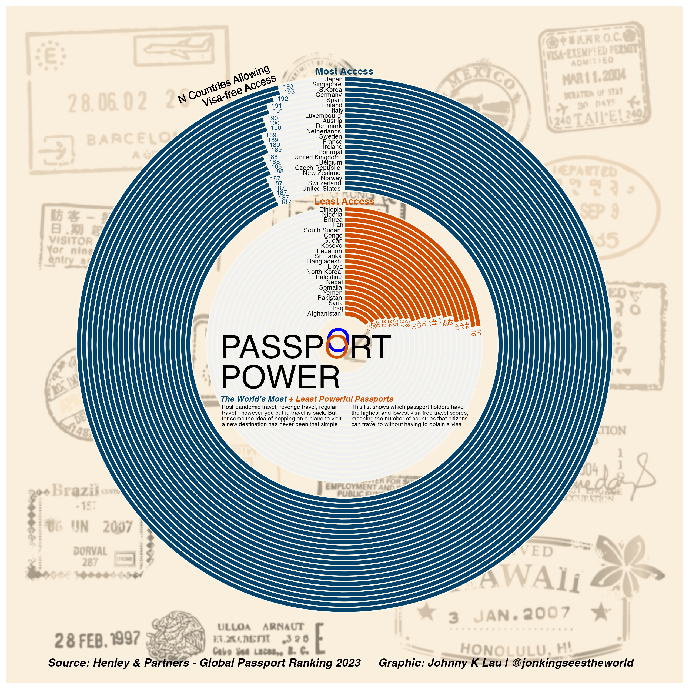

# Personal Data Viz Side Projects

## Objective
This repo documents my adventures with miscellaneous data visualization projects to be shared with others.

Most of my visualization work is programmed with R. Check out the datasets and code files if you are interested in trying out generating some of the visualisations yourself. 

# Gallery

### [What's common among Christmas movies?](./ChristmasMovies)

### [Which Harry Potter characters shared most personality attributes together?](./HarryPotter_traits)
Network graph showing the similarity of personal characteristics of 30 main Harry Potter characters. These personality attributes were selected and rated by 3 million survey respondents in ['The Open Source Psychometrics Project'](https://openpsychometrics.org/tests/characters/data/).

### [Global Passport Access Ease Ranking 2023](./AccessEaseRanking)
Re-creation of Henley & Partners graph using R coding. Data from ['Henley & Partners - Global Passport Ranking 2023'](https://www.henleyglobal.com/passport-index/ranking).

